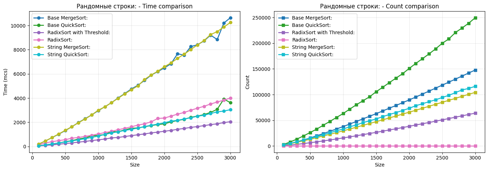
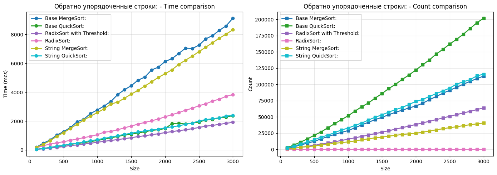
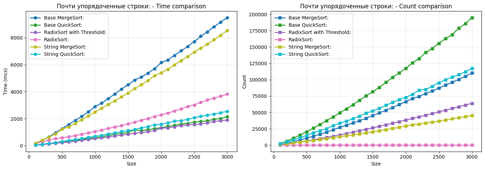

## Как запустить?

`g++ main.cpp -std=c++20 -o main`

`./main > output.txt`

Обязательно >= C++ 20

## Графики

Измерялись среднее время (в микросекундах) и среднее количество сравнений символов между собой.

Как видно, специализированные для строк алгоритмы работают прям сильно быстрее своих дефолтных версий.

Ну и побеждает по времени RadixSort с переключением на QuickSort

## Посылки

https://dsahse25.contest.codeforces.com/group/SLdI1pWUpC/contest/691754/submission/375012156

https://dsahse25.contest.codeforces.com/group/SLdI1pWUpC/contest/691754/submission/375012198

https://dsahse25.contest.codeforces.com/group/SLdI1pWUpC/contest/691754/submission/375012357

https://dsahse25.contest.codeforces.com/group/SLdI1pWUpC/contest/691754/submission/375012394